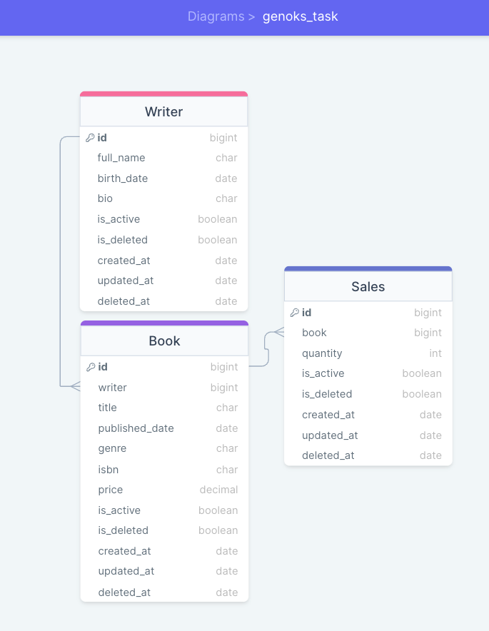

# Genoks Task

### Proje Kurulumu ve Bilgilendirme

```bash 
git clone https://github.com/omersb/genoks_task.git
```

```bash 
cd genoks_task  &&

python --version || python3 --version => 3.11

python -m venv venv
```

mac için => ```bash source venv/bin/activate ```

windows için => ```bash venv\Scripts\activate ```

```bash 
pip install -r requirements.txt
```

Veri tabanınıza göre ayarlamaları yapın Projede postgresql kullanılmıştır.

```bash 
python manage.py migrate

python manage.py runserver
```

http://127.0.0.1:8000

## Ortam Değişkenleri

Projeyi kendi localinizde çalıştırmak istiyorsanız ilk öncelikle .env dosyasını oluşturmak zorundasınız
içerisinde olması gereken değerler aşağıda yazıyor. data.env olarak gönderdim data kısmını silip .env olarakda
kullanabilirsiniz.

`DJANGO_SECRET_KEY`

`POSTGRES_HOST`

`POSTGRES_DB`

`POSTGRES_PASSWORD`

`POSTGRES_USER`

`POSTGRES_PORT`

`SCHEMA_BASE_URL`

## Api İstekleri İçin Döküman

[Dökümantasyon](http://localhost:8000/swagger/)

## Management-command Kullanımı

Yüklenecek json dosyasını data klasörü içerisine atın ve aşağıdaki komutu çalıştırın.

```bash
python manage.py import_books data/books.json
```

yada json yolunu siz belirleyebilirsiniz.

```bash
python manage.py import_books dosya_yolu
```

## Diagram şeması



## License

[MIT](https://choosealicense.com/licenses/mit/)
